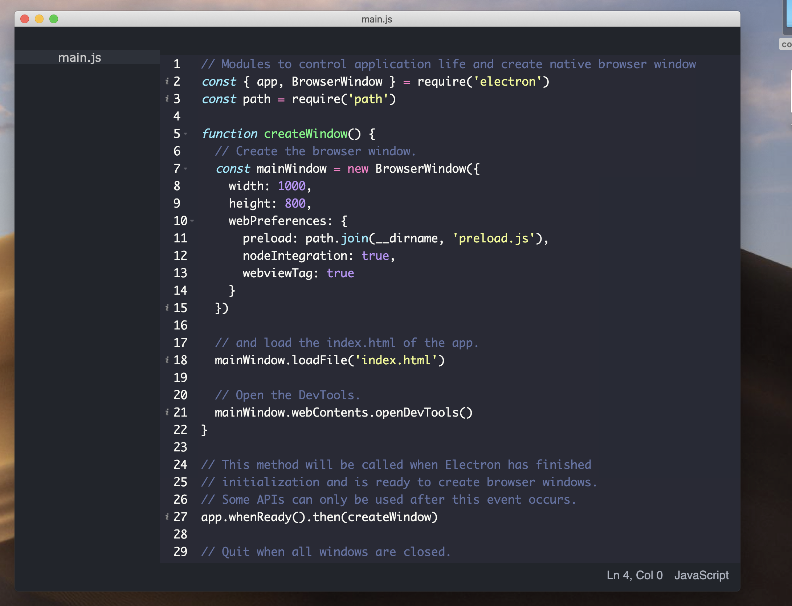

## Overview

## To Use

```bash
# Clone this repository
git clone https://github.com/mallocfreeMe/code-editor
# Go into the repository
cd code-editor
# Install dependencies
npm install
# Run the app
npm start
```

## License

[MIT License](LICENSE.md)
